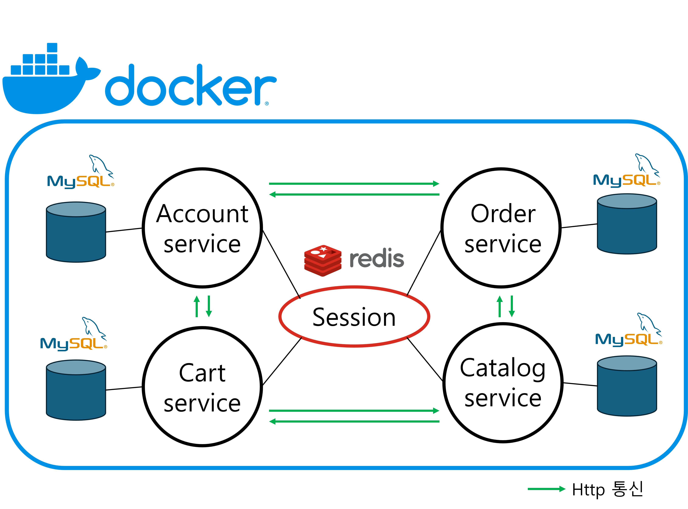

# Microservices version of JPetStore6

## Abstract of architecture

## To do...
### Initial Objectives
+ 총 다섯 가지의 메인 목표를 가지고 있다.
+ 블로그에 설명해 두었다.
+ https://se-dobby.tistory.com/89
### Common Changes
- [X] Replace stripes with standard controller
- [X] Remove stripes tags from JSP
- [X] Apply redis for session clustering

### 앞으로 구현해야 할 것들
- [X] Session 기반의 웹 앱 이므로 CSRF 공격을 예방하기 위해 CSRF 토큰을 추가한다.
  + 관련 내용 포스팅: https://se-dobby.tistory.com/91
- [ ] Gateway를 추가하고, 인증 관리 및 라우팅을 담당하도록 한다. 모든 컨트롤러에서 인증을 확인하는 If문이 제거될 수 있다.
- [ ] 어드민 기능을 추가한다. 현재 상품의 경우 조회만 가능한데, 상품의 CUD를 어드민이 담당하도록 구현한다.
- [ ] 각 서비스 내에서 데이터베이스에 락이 필요한 경우 구현한다.
- [X] 서비스가 분리되면서 ACID 트랜잭션이 보장되지 않는다. 따라서 분산 트랜잭션을 고려할 필요가 있다. 보상 트랜잭션을 통해 롤백을 수행한다.
  + #### 첫째
  + Order service에서 Product service에 상품 재고 변경을 요청하고, 주문을 삽입하는 로직을 가짐.
  + 재고 변경은 성공했으나 주문 삽입을 실패할 경우, 보상 트랜잭션 수행
  + 관련 내용 포스팅: https://se-dobby.tistory.com/90
  + #### 둘째
  + 재고 변경 요청이 Timeout 혹은 5xx인 경우, 요청이 처리되었는지 처리되지 않았는지 재확인이 필요.
  + Product service에서는 재고 변경이 일어날 때, 로깅용 디비에 주문 ID를 기록.
  + Order service에서는 주문 ID를 이용해서 재고 변경 여부를 즉시 재요청.
  + 관련 내용 포스팅: https://se-dobby.tistory.com/90
  + #### 셋째
  + 자원 변경이 일어날 때 락을 걸기.
  + 분산 트랜잭션에서 불필요한 HTTP 통신은 한 번만 이루어지도록 구현.
  + 관련 내용 포스팅: https://se-dobby.tistory.com/90
  + #### 넷째
  + 두 번째 경우에서 재요청 역시 5xx 혹은 Timeout인 경우, Product service에 회복 시간을 주기 위해 지연 재요청을 보냄.
  + Order service에서 메시징 방식으로 Scheduler server에 메시지를 보내면, Scheduler server에서 지연 시간만큼 보낸 후, 다시 Order service에 요청을 보냄.
  + Order service는 응답을 미루고 있다가, 지연된 메시지를 받으면 해당 응답을 다시 처리.
  + 다시 재고 변경 확인을 요청 후 결과에 따라 주문 처리를 성공 혹은 실패로 마침
  + 관련 내용 포스팅: https://se-dobby.tistory.com/92
- [ ] 마이크로서비스 아키텍처의 핵심은 캐시이다. 상품 조회와 같이 잘 변하지 않는 것들은 로컬 캐시로 설정해 매번 조회 쿼리가 수행되지 않도록 한다.

### 앞으로 고민해야 할 것들
- [ ] 서비스 간의 세션 공유가 적절한가? 단일 장애 지점이 되지는 않는가?
- [ ] 다른 서비스의 로직을 참고하는 상황에서 N+1 문제가 발생하지는 않는가? API 통신이기 때문에 호출량이 많아지면 엄청난 지연이 발생 가능하다.
- [ ] 현재와 같이 SSR일 경우에 다른 서비스의 데이터들을 조합까지 한 후 뷰를 반환하게 되면 응답 속도가 SPA에 비해 느려지지 않는가? 그렇다면 뷰를 분리할 것인가?

